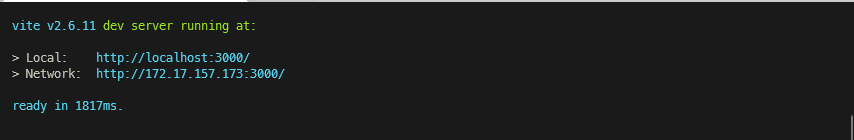

> Simple GBFS (General Bikeshare Feed Specification) consumer application for Oslo Bysykkel station data.

[](https://github.com/cez-aug/github-project-boilerplate) [](https://creativecommons.org/publicdomain/zero/1.0/)

> The application is written in JavaScript using Svelte for providing a reactive interface for displaying available bikes and docks. 

<br>

## Installing

```sh
# Assumming you have npm and node available on your device

$ npm install

```

## Usage

```sh
$ npm run dev # -- --host (if unable to connect)
```

You should see something like this:



Open the ``Local`` link in your browser or ``Network`` if you did ``npm run dev -- --host``

## Simulation tool

Simulate the location of the device by pushing any of first three buttons.

Simulate API unresponsiveness / errors by toggling the last button.

